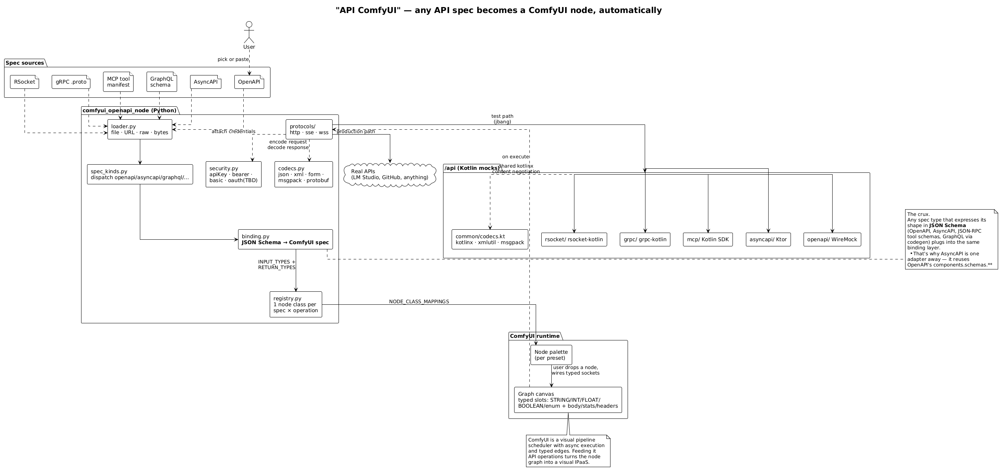
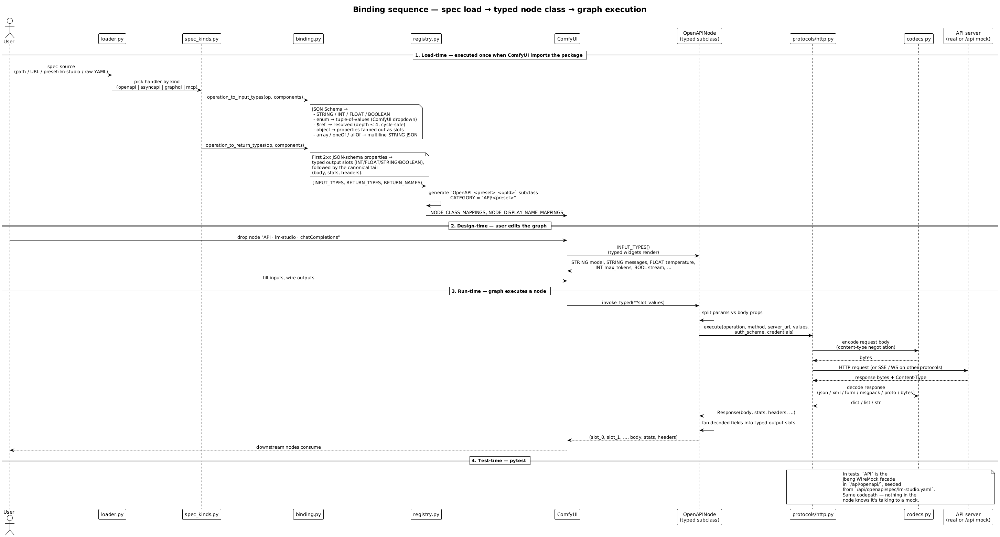
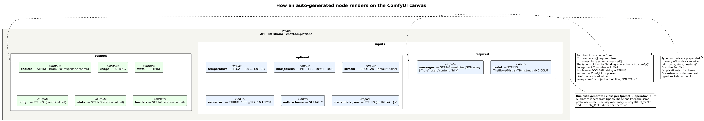
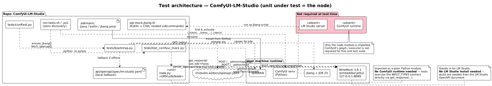
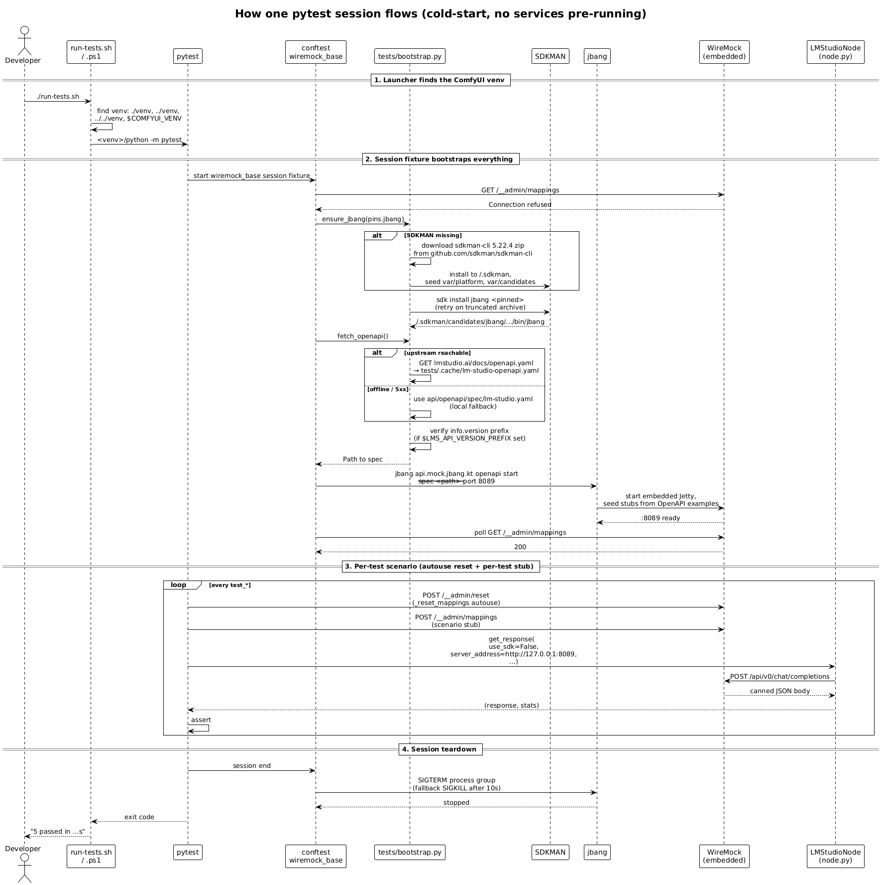

# ComfyUI LM Studio Node

A powerful ComfyUI custom node that seamlessly integrates LM Studio's local language models into your ComfyUI workflows. This node supports both text-only and multimodal (text + image) inputs, making it perfect for complex AI-driven creative workflows.


## Features

- **Unified Interface**: Single node for both text-only and text+image inputs
- **Dual Mode Support**: Works with both LM Studio SDK (recommended) and REST API
- **Vision Model Support**: Process images alongside text prompts with compatible models
- **Real-time Statistics**: Monitor tokens per second, input/output token counts
- **Thinking Tokens**: Optional support for models that use thinking tokens
- **Flexible Configuration**: Adjust temperature, max tokens, and server settings
- **Debug Mode**: Built-in debugging for troubleshooting

## Installation

### Prerequisites

1. **ComfyUI**: Make sure you have ComfyUI installed and running
2. **LM Studio**: Download and install [LM Studio](https://lmstudio.ai/) (free)
3. **Python**: Python 3.8 or higher
4. **Show Text Node**: Install [ComfyUI-Custom-Scripts](https://github.com/pythongosssss/ComfyUI-Custom-Scripts) for the Show Text node used in the example workflow (any other text display node will also work)

### Installation Steps

1. Navigate to your ComfyUI custom nodes directory:
   ```bash
   cd ComfyUI/custom_nodes/
   ```

2. Clone this repository:
   ```bash
   git clone https://github.com/gabe-init/ComfyUI-LM-Studio
   ```

3. Install the required dependencies:
   ```bash
   cd ComfyUI-LM-Studio
   pip install -r requirements.txt
   ```

4. Restart ComfyUI to load the new node

### LM Studio Setup

1. Open LM Studio and download a model (e.g., Mistral 7B Instruct)
2. Start the local server in LM Studio (default port: 1234)
3. Note the model ID from LM Studio for use in the node

## Usage

### Basic Text Generation

1. Add the "LM Studio Chat Interface" node to your workflow
2. Configure the following inputs:
   - **System Prompt**: Set the assistant's behavior
   - **User Message**: Your input prompt
   - **Model ID**: The exact model ID from LM Studio
   - **Server Address**: Usually `http://127.0.0.1:1234`
   - **Temperature**: Control randomness (0.0-1.0)
   - **Max Tokens**: Maximum response length

### Vision Model Usage

For models that support vision (like LLaVA):

1. Connect an image output to the node's image input
2. The node will automatically process both text and image
3. Make sure you're using the SDK mode for image support

### Configuration Options

- **Use SDK**: Enable for better performance and image support (requires `lmstudio` package)
- **Include Thinking Tokens**: For models that support chain-of-thought reasoning
- **Debug Mode**: Enable to see detailed processing information

## Example Workflow

An example workflow is included in `example_workflow/Example_Workflow.json`. This demonstrates:
- Basic text generation setup
- Parameter configuration
- Integration with other ComfyUI nodes

## Troubleshooting

### Connection Issues
- Ensure LM Studio server is running
- Check the server address matches LM Studio's settings
- Verify firewall isn't blocking local connections

### Performance Tips
- Use SDK mode when possible for better performance
- Adjust max tokens based on your needs
- For vision models, use reasonable image sizes

### Common Errors
- "Model not found": Verify the model ID matches exactly what's shown in LM Studio
- "Connection refused": Make sure LM Studio server is started
- Image processing issues: Install the SDK with `pip install lmstudio`

## Advanced Features

### SDK vs API Mode
- **SDK Mode**: Direct integration, supports images, better performance
- **API Mode**: REST-based fallback, text-only, works without SDK

### Debug Output
Enable debug mode to see:
- Model loading times
- Image processing status
- Token generation statistics
- Detailed error messages

## Requirements

- Python 3.8+
- ComfyUI
- LM Studio (running locally)
- See `requirements.txt` for Python packages

## API ComfyUI — concept

The node is a generic **API ComfyUI** surface: pick a spec kind
(OpenAPI today; AsyncAPI / GraphQL / MCP / gRPC / RSocket slots wired
through `spec_kinds.py`), load the spec from path / URL / raw JSON /
raw YAML / bytes, and the binding layer translates each operation's
JSON Schema into a ComfyUI node spec — `INPUT_TYPES`, `RETURN_TYPES`,
`RETURN_NAMES` — with typed slots (`STRING` / `INT` / `FLOAT` /
`BOOLEAN` / enum dropdowns). LM Studio is the first bundled preset.







Sources: [`puml/api-comfyui-concept.puml`](./puml/api-comfyui-concept.puml),
[`puml/api-comfyui-binding.puml`](./puml/api-comfyui-binding.puml),
[`puml/api-comfyui-node-ui.puml`](./puml/api-comfyui-node-ui.puml).

Why the JSON Schema spine matters: **AsyncAPI shares OpenAPI's
`components.schemas` vocabulary**, so the binding layer built for
OpenAPI becomes AsyncAPI the moment you add an adapter that hands
`binding.py` an `(operation-like dict, components-like dict)` pair.
GraphQL, MCP tool manifests and gRPC plug in the same way.

## Testing

The node is the unit under test: a ComfyUI node's public surface is just
`INPUT_TYPES` + `get_response(...)`, so the suite drives that contract
directly. The tricky part is that neither of the node's external
dependencies is required at test time:

- **ComfyUI runtime is not needed.** `node.py` is imported as a plain
  Python module. `pytest.ini` uses `--import-mode=importlib` and
  `--ignore=__init__.py` so the ComfyUI-discovery `__init__.py` (with
  its relative import) is skipped.
- **LM Studio is not needed.** An embedded [WireMock](https://wiremock.org/)
  server stands in for it. WireMock is launched from a jbang-backed
  Kotlin script (`api/api.mock.jbang.kt openapi start`) seeded from LM
  Studio's OpenAPI document (online first, with
  `api/openapi/spec/lm-studio.yaml` as offline fallback).

### What we test

`tests/test_comfyui_mock.py` exercises `LMStudioNode.get_response` with
`use_sdk=False` (API path) against the WireMock facade:

| Case                  | Checks                                                                      |
| --------------------- | ---------------------------------------------------------------------------- |
| `happy_path`          | Happy completion: content extracted, stats formatted with tokens/sec + I/O   |
| `thinking_stripped`   | With `thinking_tokens=False`, `<think>…</think>` is removed from the output  |
| `http_500`            | Server error → `"Error: …"` string, stats fall back to the node's default    |
| `request_shape`       | The HTTP request body carries model, temperature, stream=false, messages    |
| `connection_refused`  | Unreachable server → `"Connection error …"`, stats default                   |

The SDK path (`use_sdk=True`) is covered separately with `unittest.mock`
against the `lmstudio` package — it doesn't go through HTTP.

### How we test — architecture diagrams

Pre-rendered PNGs are checked into `puml/` alongside the sources.
Re-render with any of:

- **Browser (no install):** [plantuml-wasm](https://github.com/plantuml/plantuml-wasm)
  — pure-JS viewer. Paste a `.puml` file.
- **Server URL:** https://www.plantuml.com/plantuml/uml/
- **VS Code:** the *PlantUML* extension renders `.puml` inline.
- **CLI:** `java -jar plantuml.jar -tpng puml/*.puml` (requires `graphviz`
  for component diagrams).

**Component view** — what's wired to what, and what's explicitly *absent*
(ComfyUI runtime, LM Studio server):



**Sequence view** — one cold-start pytest session, end to end:



Sources: [`puml/test-components.puml`](./puml/test-components.puml),
[`puml/test-sequence.puml`](./puml/test-sequence.puml).

### How to run

Both launchers discover the ComfyUI virtualenv in `./venv`, `./.venv`,
`../venv`, `../.venv`, `../../venv`, or `../../.venv`. Override with
`COMFYUI_VENV=/path/to/venv`.

```bash
./run-tests.sh                                   # Linux / macOS
./run-tests.sh tests/test_comfyui_mock.py -v     # extra pytest args forward
```

```powershell
.\run-tests.ps1                                  # Windows
.\run-tests.ps1 -- -v                            # forward flags
```

First run bootstraps SDKMAN + jbang (pins in `.sdkmanrc`) and fetches the
OpenAPI spec. Subsequent runs skip the install. `SKIP_BOOTSTRAP=1`
requires a pre-running WireMock at `$WIREMOCK_URL` (default
`http://127.0.0.1:8089`).

### CI

`.github/workflows/tests.yml` runs the same `./run-tests.sh` on every
push and PR. It caches `~/.sdkman`, `~/.jbang`, and `~/.m2/repository`
so the first run installs everything (~3 min) and subsequent runs
reuse the cache (~20 s).

### Manual facade launch

```bash
source ~/.sdkman/bin/sdkman-init.sh && sdk env
jbang api/api.mock.jbang.kt openapi start start --spec api/openapi/spec/lm-studio.yaml
```

## Contributing

Contributions are welcome! Please feel free to submit issues or pull requests.

## License

MIT License

Copyright (c) 2024

Permission is hereby granted, free of charge, to any person obtaining a copy
of this software and associated documentation files (the "Software"), to deal
in the Software without restriction, including without limitation the rights
to use, copy, modify, merge, publish, distribute, sublicense, and/or sell
copies of the Software, and to permit persons to whom the Software is
furnished to do so, subject to the following conditions:

The above copyright notice and this permission notice shall be included in all
copies or substantial portions of the Software.

THE SOFTWARE IS PROVIDED "AS IS", WITHOUT WARRANTY OF ANY KIND, EXPRESS OR
IMPLIED, INCLUDING BUT NOT LIMITED TO THE WARRANTIES OF MERCHANTABILITY,
FITNESS FOR A PARTICULAR PURPOSE AND NONINFRINGEMENT. IN NO EVENT SHALL THE
AUTHORS OR COPYRIGHT HOLDERS BE LIABLE FOR ANY CLAIM, DAMAGES OR OTHER
LIABILITY, WHETHER IN AN ACTION OF CONTRACT, TORT OR OTHERWISE, ARISING FROM,
OUT OF OR IN CONNECTION WITH THE SOFTWARE OR THE USE OR OTHER DEALINGS IN THE
SOFTWARE.
